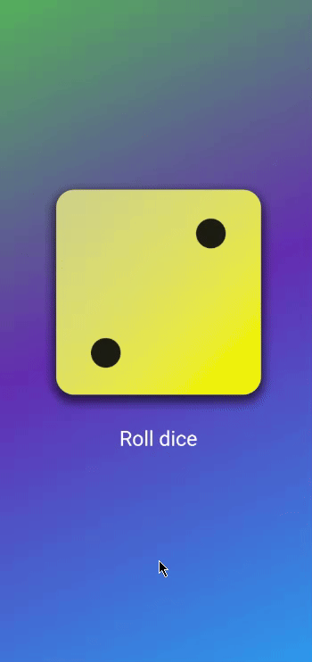

# Rolling Dice App

## Description

The **Rolling Dice App** is a simple and interactive application designed to enhance skills in state management, asset handling, random number generation, and mathematical operations.

## Features

- **State Management:** Efficiently manage the state of the application to ensure seamless user interactions.
- **Asset Handling:** Incorporate and manage graphical assets for a visually appealing interface.
- **Random Number Generation:** Implement randomness to simulate realistic dice rolls.
- **Mathematical Operations:** Utilize mathematical logic to calculate and display results.
- **Pulse Animation:** Continuous breathing effect applied to the dice image and roll button for enhanced visual feedback.
- **Rotation Animation:** Smooth rotation effect when rolling the dice, combined with pulse animation for engaging user experience.